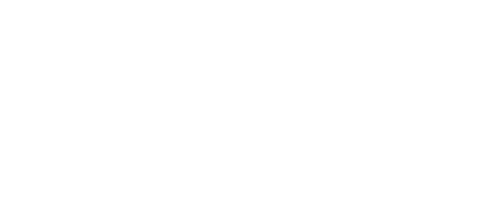
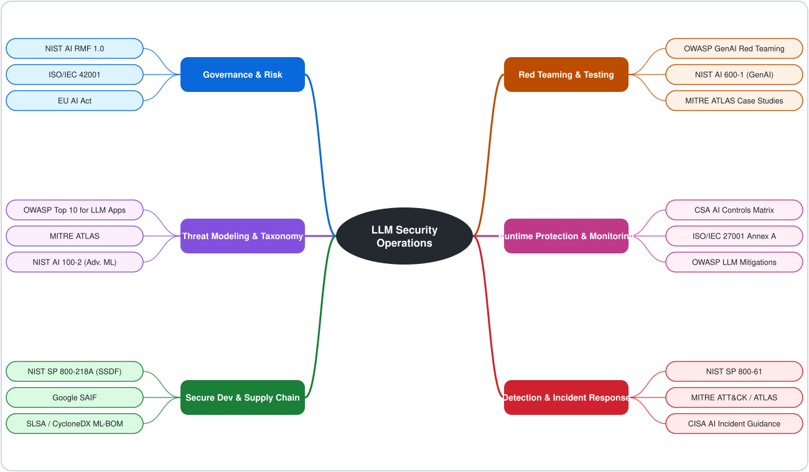
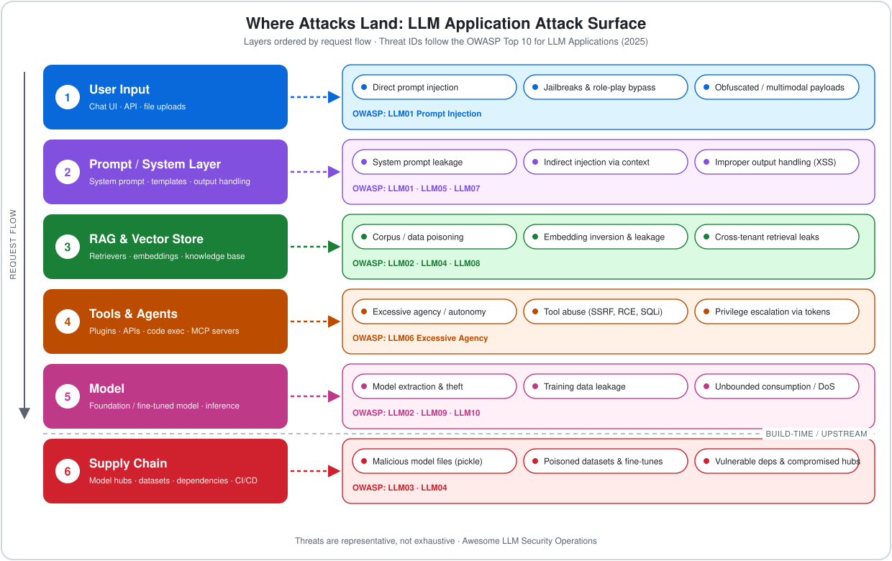
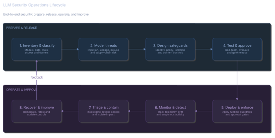
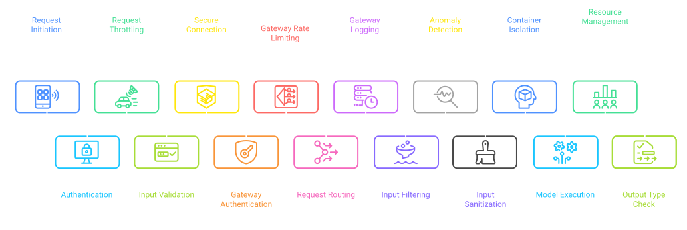
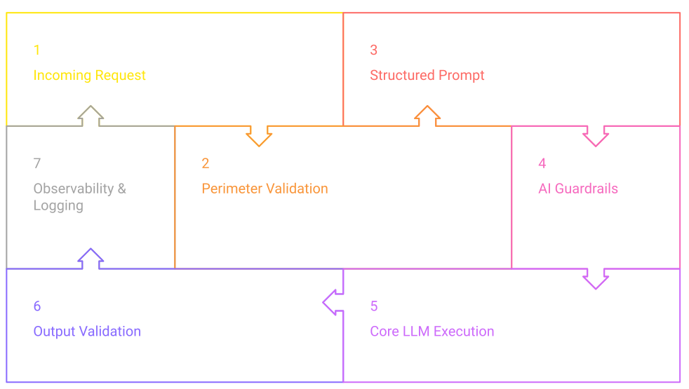
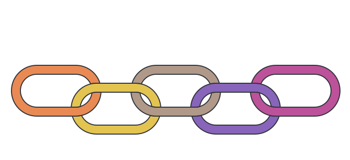
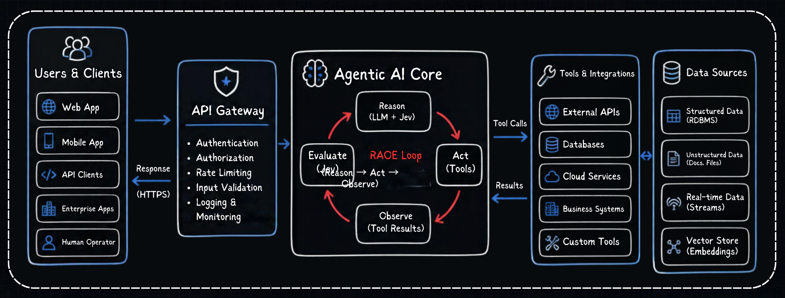
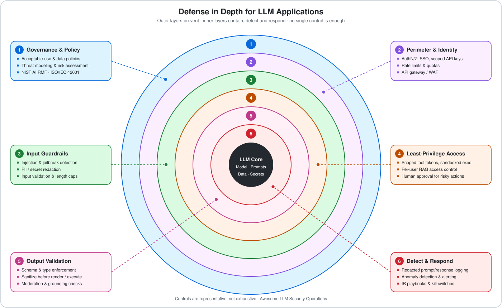

<!--lint disable awesome-github awesome-license awesome-list-item awesome-toc double-link list-item-indent no-emphasis-as-heading no-heading-punctuation table-cell-padding table-pipe-alignment unordered-list-marker-style-->

<picture>
  <source
    media="(prefers-color-scheme: dark)"
    srcset="assets/light.svg"
  >
  <source
    media="(prefers-color-scheme: light)"
    srcset="assets/dark.svg"
  >
  
</picture>

 

# Awesome LLMSecOps 

*A curated list of tools, frameworks, research, and best practices for securing Large Language Model and Generative AI applications throughout their entire lifecycle.*

 

<svg width="916" height="34" xmlns="http://www.w3.org/2000/svg">
  <rect width="100%" height="100%" fill="#FFFFFF"/>
  <text x="458" y="23.5" font-family="'Comic Sans MS', cursive" font-size="26" font-weight="normal" fill="#6366f1" text-anchor="middle">Prompt → Model → Tools → Data → Deployment → Monitoring → Security</text>
</svg>

 

[Submit a Resource](https://github.com/ARUNAGIRINATHAN-K/awesome-llmsecops/issues/new?template=resource_submission.yml) · [Report Broken Link](https://github.com/ARUNAGIRINATHAN-K/awesome-llmsecops/issues/new?template=broken_link.yml) · [Request Category](https://github.com/ARUNAGIRINATHAN-K/awesome-llmsecops/issues/new?template=category_request.yml)

 

---

## What is LLMSecOps?

LLMSecOps is a new discipline integrating cybersecurity throughout the entire lifecycle of Large Language Model (LLM) and Generative AI applications, from design to incident response. As LLMs become fundamental to enterprise and critical infrastructure, the attack surface expands. LLMSecOps addresses this through:

 

  

 

## LLMSecOps Lifecycle

<svg width="499" height="22" xmlns="http://www.w3.org/2000/svg">
  <rect width="100%" height="100%" fill="#FFFFFF"/>
  <text x="249.5" y="15" font-family="'Comic Sans MS', cursive" font-size="16" font-weight="normal" fill="#6366f1" text-anchor="middle">Plan → Build → Train → Deploy → Operate → Monitor → Improve</text>
</svg>

 

*   **Secure Design:** Threat modeling, architecture review, and security requirements from inception.
*   **Secure Development:** Secure coding, prompt hardening, and security-aware training.
*   **Secure Deployment:** Infrastructure security, API hardening, guardrails, and access controls.
*   **Secure Operations:** Runtime monitoring, anomaly detection, and behavioral analysis.
*   **Agentic Security:** Securing autonomous AI agents, tool use, and multi-agent orchestration.
*   **Compliance & Governance:** Regulatory alignment, audit trails, and organizational policies.

---

## Contents

- [What is LLMSecOps?](#what-is-llmsecops)
- [Quick Start Guide](#quick-start-guide)
- [Categories](#categories)
  - [Phase 1: Design & Governance](#phase-1-design--governance)
    - [Threat Modeling & Risk Assessment](#threat-modeling--risk-assessment)
    - [Compliance & Governance](#compliance--governance)
    - [Standards & Frameworks](#standards--frameworks)
    - [Learning Resources & Research Communities](#learning-resources--research-communities)
  - [Phase 2: Development & Training](#phase-2-development--training)
    - [Model Security & Training Integrity](#model-security--training-integrity)
    - [Supply Chain Security](#supply-chain-security)
    - [Data Privacy & PII Protection](#data-privacy--pii-protection)
  - [Phase 3: Deployment & Runtime](#phase-3-deployment--runtime)
    - [Prompt Security](#prompt-security)
    - [RAG Security](#rag-security)
    - [Agentic AI Security](#agentic-ai-security)
    - [AI Gateways & Runtime Guardrails](#ai-gateways--runtime-guardrails)
    - [Deployment Security](#deployment-security)
    - [Confidential Computing & Hardware Isolation](#confidential-computing--hardware-isolation)
  - [Phase 4: Operations & Response](#phase-4-operations--response)
    - [Monitoring & Observability](#monitoring--observability)
    - [Red Teaming & Adversarial Testing](#red-teaming--adversarial-testing)
    - [Evaluation & Benchmarking](#evaluation--benchmarking)
    - [Incident Response for AI Systems](#incident-response-for-ai-systems)
- [Standards & Frameworks Overview](#standards--frameworks-overview)
- [Related Awesome Lists](#related-awesome-lists)
- [Community](#community)
- [Contributing](#contributing)
- [License](#license)

---

---

## Quick Start Guide

### For Security Engineers
1. Review the OWASP Top 10 for LLM Applications 2025 for LLM-specific threat landscape.
2. Explore Red Teaming & Adversarial Testing frameworks like Garak and Giskard.
3. Set up Monitoring & Observability and AgentOps for production LLM systems.
4. Build Incident Response for AI Systems playbooks.

### For ML/AI Engineers
1. Harden prompts with Prompt Security best practices.
2. Integrate AI Gateways & Runtime Guardrails into your pipeline.
3. Apply content provenance and watermarking via SynthID.
4. Secure your retrieval pipelines with RAG Security patterns.

### For Platform & DevOps Engineers
1. Isolate sensitive workloads using Confidential Computing & Hardware Isolation.
2. Secure infrastructure with Deployment Security tooling.
3. Implement AI Gateways & Runtime Guardrails at the edge.
4. Automate compliance with Compliance & Governance tools.

### For Security Researchers
1. Study the latest research papers across all lifecycle phases.
2. Use Red Teaming & Adversarial Testing frameworks for vulnerability discovery.
3. Benchmark with Evaluation & Benchmarking suites like DeepEval and Giskard.
4. Explore emerging risks in Agentic AI Security.

### For Enterprise Architects & CISOs
1. Understand regulatory requirements in Compliance & Governance.
2. Review the Standards & Frameworks Overview.
3. Assess Supply Chain Security posture.
4. Plan Incident Response for AI Systems capabilities.

---

## Categories

 

  

 

---

## Phase 1: Design & Governance

### Threat Modeling & Risk Assessment

- [AI Incident Database](https://incidentdatabase.ai/) - Repository of real-world AI incidents and failures for learning and reference.
- [AI Vulnerability Database (AVID)](https://avidml.org/) - Community-driven database categorizing AI system failures, vulnerabilities, and safety risks.
- [MITRE ATLAS](https://atlas.mitre.org/) - Adversarial Threat Landscape for AI Systems knowledge base mapping real-world attacks to threat tactics.

### Compliance & Governance

- [AI Fairness 360 (AIF360)](https://github.com/Trusted-AI/AIF360) - Open-source toolkit for detecting and mitigating algorithmic bias in machine learning models.
- [CCPA/CPRA](https://oag.ca.gov/privacy/ccpa) - California Consumer Privacy Act regulating automated decision-making and consumer data privacy rights.
- [Datasheets for Datasets](https://arxiv.org/abs/1803.09010) - Structured documentation framework detailing dataset provenance, composition, and intended usage scope.
- [EU AI Act](https://artificialintelligenceact.eu/) - Comprehensive European regulation classifying AI systems by risk level with binding compliance requirements.
- [Executive Order on Safe, Secure, and Trustworthy AI](https://www.whitehouse.gov/briefing-room/presidential-actions/) - US federal directive establishing AI safety, security, and privacy governance standards.
- [GDPR](https://gdpr-info.eu/) - European General Data Protection Regulation governing AI training data processing and model output privacy.
- [GPT-4 System Card](https://cdn.openai.com/papers/gpt-4-system-card.pdf) - OpenAI document detailing safety evaluations, red teaming, and risk mitigations for GPT-4.
- [HIPAA](https://www.hhs.gov/hipaa/) - US health data protection regulations governing medical and healthcare AI application compliance.
- [ISO/IEC 27001:2022](https://www.iso.org/standard/27001) - International standard for information security management systems applicable to AI host infrastructure.
- [ISO/IEC 42001:2023](https://www.iso.org/standard/81230.html) - Certifiable international management system standard specifically for AI governance and risk management.
- [MLflow](https://github.com/mlflow/mlflow) - Platform for ML lifecycle management featuring model registries, artifact versioning, and compliance audit trails.
- [Model Cards for Model Reporting](https://arxiv.org/abs/1810.03993) - Framework for transparent model reporting covering intended use, evaluation metrics, and safety limitations.
- [NIST AI 600-1: Generative AI Profile](https://www.nist.gov/publications/ai-600-1) - NIST guidance addressing unique risks in generative AI including hallucinations, IP leakage, and synthetic content.
- [NIST AI Risk Management Framework (AI RMF)](https://www.nist.gov/itl/ai-risk-management-framework) - Voluntary framework providing structured governance (Govern, Map, Measure, Manage) for AI risk management.
- [NIST Privacy Framework](https://www.nist.gov/privacy-framework) - Voluntary framework for managing privacy risks in AI and automated decision systems.
- [Responsible AI Toolbox](https://github.com/microsoft/responsible-ai-toolbox) - Microsoft platform for model debugging, fairness assessment, and interpretability analysis.
- [Weights & Biases](https://github.com/wandb/wandb) - Experiment tracking and model management platform providing data lineage tracking and audit capabilities.

### Standards & Frameworks

- [Google Secure AI Framework (SAIF)](https://blog.google/technology/safety-security/introducing-googles-secure-ai-framework/) - Conceptual framework for securing AI systems across infrastructure, supply chain, and model deployments.
- [NIST AI 100-2: Adversarial Machine Learning](https://csrc.nist.gov/pubs/ai/100/2/e2023/final) - Comprehensive taxonomy of adversarial machine learning attacks, defenses, and security terminology.
- [OWASP MCP Top 10](https://genai.owasp.org/) - Community standard defining security risks in Model Context Protocol integrations.
- [OWASP Top 10 for Agentic Applications](https://genai.owasp.org/) - Industry reference for critical security risks in autonomous AI agent systems.
- [OWASP Top 10 for LLM Applications (2025)](https://owasp.org/www-project-top-10-for-large-language-model-applications/) - Standard reference for top security risks in Large Language Model applications.

### Learning Resources & Research Communities

- [AI Engineering by Chip Huyen](https://www.oreilly.com/library/view/ai-engineering/9781098166298/) - Practical guide to building production AI applications with safety, reliability, and security engineering.
- [AI Village](https://aivillage.org/) - Community of hackers and researchers advancing AI security at DEF CON, RSA, and global security conferences.
- [Adversarial Machine Learning](https://www.cambridge.org/core/) - Academic reference textbook covering mathematical foundations of adversarial attacks and model defenses.
- [Anthropic Research](https://www.anthropic.com/research) - Publications on AI alignment, Constitutional AI, and mechanistic interpretability.
- [Coursera Machine Learning Specialization](https://www.coursera.org/specializations/machine-learning-introduction) - Foundational machine learning concepts essential for understanding AI security vulnerabilities.
- [DEFCON AI Village](https://aivillage.org/defcon/) - Annual AI security hacking competitions, capture-the-flag events, and workshop materials.
- [Fast.AI Practical Deep Learning](https://course.fast.ai/) - Practical deep learning course emphasizing hands-on implementation and model behavior analysis.
- [Google DeepMind Blog](https://deepmind.google/discover/blog/) - Research updates on frontier model safety, evaluation, watermarking, and alignment.
- [Hugging Face Blog](https://huggingface.co/blog) - Technical articles on ML security advisories, open-weight safety, and model evaluation.
- [Machine Learning Security by Evelyn Trautmann](https://www.oreilly.com/library/view/machine-learning-security/9781098122638/) - Practitioner guide to securing machine learning systems against real-world adversarial attacks.
- [OWASP GenAI Security Project](https://genai.owasp.org/) - Educational guides, top 10 lists, and cheat sheets for generative AI security.
- [OpenAI Research](https://openai.com/research/) - Safety evaluations, red teaming reports, and alignment research papers.
- [Papers with Code](https://paperswithcode.com/) - Curated index linking AI research papers directly to open-source code implementations.
- [Simon Willison's Weblog](https://simonwillison.net/) - Daily insights and practical analysis of prompt injection vulnerabilities and LLM security.
- [Stanford CS224N: NLP with Deep Learning](https://cs224n.stanford.edu/) - Comprehensive Stanford course on deep learning models for natural language processing.
- [Stanford CS336: Language Modeling from Scratch](https://cs336.stanford.edu/) - Advanced Stanford course covering architecture, training, and security internals of modern LLMs.
- [Trail of Bits Blog](https://blog.trailofbits.com/) - Technical security audits and vulnerability research on AI frameworks and smart contracts.
- [arXiv cs.AI](https://arxiv.org/list/cs.AI/recent) - Open preprint archive for artificial intelligence research.
- [arXiv cs.CR](https://arxiv.org/list/cs.CR/recent) - Open preprint archive for cryptography and cybersecurity research.

---

## Phase 2: Development & Training

### Model Security & Training Integrity

 

  

 

- [Constitutional AI: Harmlessness from AI Feedback](https://arxiv.org/abs/2212.08073) - Alignment method using model self-critique to enforce safety policies without human intervention.
- [Glaze & Nightshade](https://glaze.cs.uchicago.edu/) - Data protection tools engineered by University of Chicago researchers preventing unauthorized AI model training and data poisoning.
- [OpenAI Evals](https://github.com/openai/evals) - Open-source framework for evaluating language model performance and safety alignment.
- [Poisoning Language Models During Instruction Tuning](https://arxiv.org/abs/2305.00944) - Research demonstrating data poisoning vulnerabilities during instruction fine-tuning.
- [Representation Engineering](https://arxiv.org/abs/2310.01405) - Methodology for reading and controlling internal LLM neural representations to enforce safety.
- [Safetensors](https://github.com/huggingface/safetensors) - Fast, safe serialization format for deep learning tensors preventing arbitrary code execution.
- [Shadow Alignment](https://arxiv.org/abs/2310.02949) - Research showing minimal fine-tuning can strip safety alignment from aligned LLMs.
- [Sleeper Agents: Deceptive LLMs](https://arxiv.org/abs/2401.05566) - Anthropic study on deceptive model backdoors that persist through standard safety fine-tuning.
- [Stealing Part of a Production LLM](https://arxiv.org/abs/2403.06634) - Model extraction attack demonstrating partial model weight recovery via API access.
- [SynthID](https://deepmind.google/technologies/synthid/) - Google DeepMind technology for embedding and detecting imperceptible digital watermarks in AI-generated text, audio, images, and video.
- [TextAttack](https://github.com/QData/TextAttack) - Python framework for adversarial attacks, data augmentation, and adversarial training in NLP.
- [TorchAttacks](https://github.com/Harry24k/adversarial-attacks-pytorch) - PyTorch library providing 70+ adversarial attack implementations for neural networks.
- [Training Data Extraction Attacks](https://arxiv.org/abs/2311.17035) - Research revealing practical techniques for extracting sensitive training data from production LLMs.
- [Training LLMs to Follow Instructions with Human Feedback](https://arxiv.org/abs/2203.02155) - Foundational InstructGPT paper establishing RLHF alignment methodology.

### Supply Chain Security

- [Binary Authorization](https://cloud.google.com/binary-authorization) - Google Cloud deploy-time security control ensuring only signed container images are run.
- [CycloneDX](https://github.com/CycloneDX/specification) - OWASP Software Bill of Materials (SBOM) standard with dedicated AI/ML model metadata extensions.
- [Do You Trust Your Model? ML Supply Chain Malware](https://arxiv.org/abs/2305.12672) - Analysis of malware distribution risks through public machine learning model registries.
- [Grype](https://github.com/anchore/grype) - Open-source vulnerability scanner for container images and filesystems supporting SBOM input.
- [Hugging Face Model Cards](https://huggingface.co/docs/hub/models-cards) - Open specification for documenting model capabilities, datasets, and limitations on Hugging Face Hub.
- [Model Transparency (Model Signing)](https://github.com/sigstore/model-transparency) - OpenSSF specification for cryptographically signing machine learning models.
- [ModelScan](https://github.com/protectai/modelscan) - Open-source CLI tool scanning serialized model files (PyTorch, Pickle, Keras, H5) for malware execution.
- [SLSA Framework](https://slsa.dev/) - Supply-chain Levels for Software Artifacts specification enforcing end-to-end build integrity.
- [Sigstore](https://github.com/sigstore/sigstore) - Open-source keyless signing and cryptographic transparency log for software and model artifacts.
- [Snyk](https://github.com/snyk/cli) - Developer security platform auditing dependencies and container images for AI/ML vulnerabilities.
- [Socket](https://socket.dev/) - Supply chain defense tool detecting malicious behavior, telemetry, and typosquatting in open-source packages.
- [SPDX](https://github.com/spdx/spdx-spec) - ISO international standard for Software Bill of Materials including AI hardware and dataset profiles.
- [Spinning Language Models](https://arxiv.org/abs/2112.05224) - Research on weight-poisoning backdoors designed to manipulate LLM sentiment and opinion.
- [Syft](https://github.com/anchore/syft) - CLI tool generating detailed Software Bill of Materials (SBOM) from container images and source code.
- [Tekton Chains](https://github.com/tektoncd/chains) - Kubernetes-native pipeline provenance generator generating signed SLSA attestations.

### Data Privacy & PII Protection

- [ARX Data Anonymization Tool](https://github.com/arx-deidentifier/arx) - Open-source anonymization software supporting k-anonymity, l-diversity, and differential privacy.
- [CrypTen](https://github.com/facebookresearch/CrypTen) - PyTorch-based framework for privacy-preserving machine learning via secure multi-party computation.
- [Differential Privacy Has Disparate Impact on Accuracy](https://arxiv.org/abs/1905.12101) - Study analyzing trade-offs between differential privacy protections and sub-population model accuracy.
- [Extracting Training Data from LLMs](https://arxiv.org/abs/2012.07805) - Seminal research proving LLMs unintentionally memorize and regurgitate private training data.
- [Membership Inference Attacks Against ML Models](https://arxiv.org/abs/1610.05820) - Foundational research demonstrating privacy risks through training set membership inference.
- [Opacus](https://github.com/pytorch/opacus) - PyTorch library training deep learning models with formal Differential Privacy (DP-SGD) guarantees.
- [OpenDP](https://github.com/opendp/opendp) - Open-source suite of statistical algorithms implementing mathematically proven differential privacy.
- [Presidio](https://github.com/microsoft/presidio) - Microsoft SDK for context-aware PII detection, redaction, and anonymization in unstructured text.
- [TensorFlow Privacy](https://github.com/tensorflow/privacy) - TensorFlow library implementing differentially private optimizers for private model training.
- [The Secret Sharer: Unintended Memorization](https://arxiv.org/abs/1802.08232) - Empirical methodology for measuring unintended secret memorization in neural networks.

---

## Phase 3: Deployment & Runtime

### Prompt Security

 

  

 

- [Ignore This Title and HackAPrompt](https://arxiv.org/abs/2311.16119) - Empirical study analyzing thousands of human-generated prompt injection attacks.
- [Jailbroken: How Does LLM Safety Training Fail?](https://arxiv.org/abs/2307.02483) - Theoretical framework categorizing systemic failure modes in LLM safety alignment.
- [LLM Guard](https://github.com/protectai/llm-guard) - Comprehensive toolkit scanning LLM inputs and outputs for prompt injections, toxicity, and PII.
- [LangKit](https://github.com/whylabs/langkit) - Open-source text metrics toolkit monitoring prompt toxicity, jailbreaks, and response quality.
- [Not What You've Signed Up For: Indirect Prompt Injection](https://arxiv.org/abs/2302.12173) - Breakthrough paper introducing indirect prompt injection threats in integrated LLM apps.
- [OWASP GenAI Security Project](https://genai.owasp.org/) - OWASP project providing practical guidance and defensive cheatsheets for prompt injection prevention.
- [Prompt Armor](https://promptarmor.com/) - Enterprise security API detecting and neutralizing prompt injection attacks in real time.
- [Prompt Injection Attack Against LLM Applications](https://arxiv.org/abs/2306.05499) - Systematic taxonomy of direct and indirect prompt injection vectors.
- [Rebuff](https://github.com/protectai/rebuff) - Multi-layered prompt injection detection SDK utilizing heuristics, vector DBs, and canary tokens.
- [Tensor Trust](https://arxiv.org/abs/2311.01011) - Benchmark dataset of real-world adversarial prompt injections collected from an online game.
- [Universal Adversarial Suffixes](https://arxiv.org/abs/2307.15043) - Automated optimization attack creating transferable adversarial suffix strings that bypass alignment.
- [Vigil](https://github.com/deadbits/vigil-llm) - Open-source LLM security scanner using YARA rules, embeddings, and transformers to catch prompt injections.

### RAG Security

 

  

 

- [Chroma](https://github.com/chroma-core/chroma) - Open-source vector database featuring role-based access control and tenant-isolated collections.
- [LlamaIndex Security](https://github.com/run-llama/llama_index) - Data framework for LLMs offering tenant filtering, query sandboxing, and secure document loading.
- [Pandora's White-Box](https://arxiv.org/abs/2402.17012) - White-box training data detection technique evaluating data leakage risks in RAG indices.
- [PoisonedRAG: Knowledge Corruption Attacks](https://arxiv.org/abs/2402.07867) - Research detailing targeted document injection attacks against RAG knowledge stores.
- [Poisoning Retrieval Corpora via Adversarial Passages](https://arxiv.org/abs/2310.19156) - Attack methodology corrupting RAG retrieval results using optimized adversarial passages.
- [Qdrant](https://github.com/qdrant/qdrant) - High-performance vector search engine supporting API key authentication, TLS, and payload filtering.
- [Ragas](https://github.com/explodinggradients/ragas) - Evaluation suite assessing RAG retrieval precision, answer faithfulness, and context relevance.
- [Weaviate](https://github.com/weaviate/weaviate) - Enterprise vector database providing RBAC, multi-tenancy, and encrypted data-at-rest.

### Agentic AI Security

 

  

 

- [AgentDojo](https://github.com/ethz-spylab/agentdojo) - Dynamic evaluation environment benchmarking attacks and defenses for tool-using AI agents.
- [AgentOps](https://github.com/AgentOps-AI/agentops) - Observability and monitoring platform tracking AI agent execution sessions, cost metrics, tool calls, and security compliance.
- [CrewAI Security](https://github.com/crewAIInc/crewAI) - Multi-agent orchestration platform supporting role-based tool restrictions and execution boundaries.
- [Injecagent](https://arxiv.org/abs/2403.02691) - Benchmark evaluating LLM agent vulnerability to indirect prompt injections via external tool outputs.
- [Invariant Guardrails](https://github.com/invariantlabs-ai/invariant) - Policy specification engine enforcing semantic authorization rules on agent tool execution.
- [LangChain Security](https://python.langchain.com/docs/security/) - Guidelines and sandboxing tools for preventing unauthorized tool execution in LangChain agents.
- [MCP Firewall](https://github.com/ressl/mcp-firewall) - Runtime security proxy inspecting Model Context Protocol messages for unauthorized tool calls and PII.
- [MCP Scanner](https://github.com/invariantlabs-ai/mcp-scan) - Security auditor scanning Model Context Protocol servers for tool poisoning and command execution risks.
- [MCP Shield](https://github.com/riseandignite/mcp-shield) - Security scanner detecting credential exposure, typosquatting, and RCE vulnerabilities in MCP tools.
- [R-Judge](https://arxiv.org/abs/2401.10019) - Safety benchmark evaluating LLM agent risk awareness across interactive real-world environments.

### AI Gateways & Runtime Guardrails

 

  

 

- [Bifrost](https://github.com/maximhq/bifrost) - Open-source AI gateway providing load balancing, model routing, rate limiting, and governance controls.
- [Guardrails AI](https://github.com/guardrails-ai/guardrails) - Open-source validation framework enforcing schema, type, and safety guarantees on LLM responses.
- [Kong AI Gateway](https://github.com/Kong/kong) - Enterprise API gateway equipped with AI security plugins for prompt governance and API key protection.
- [Lakera Guard](https://www.lakera.ai/) - Low-latency API protecting LLM applications against prompt injections, data leakage, and toxic content.
- [LiteLLM](https://github.com/BerriAI/litellm) - Lightweight proxy managing key rotation, budget caps, fallback routing, and access logging for 100+ LLMs.
- [NVIDIA NeMo Guardrails](https://github.com/NVIDIA/NeMo-Guardrails) - Programmable toolkit using Colang to control LLM dialogue flow, safety, and security guardrails.
- [Portkey AI Gateway](https://github.com/Portkey-ai/gateway) - Production gateway adding security guardrails, fallback routing, and trace logging to LLM APIs.

### Deployment Security

- [API Security Checklist](https://github.com/shieldfy/api-security-checklist) - Comprehensive checklist of security best practices for hardening RESTful and GraphQL APIs.
- [AWS WAF](https://aws.amazon.com/waf/) - Managed web application firewall filtering malicious traffic and rate-limiting LLM endpoint calls.
- [Cilium](https://github.com/cilium/cilium) - eBPF-based networking tool securing container communications with transparent encryption and L7 policies.
- [Envoy Proxy](https://github.com/envoyproxy/envoy) - Cloud-native edge proxy providing mTLS, rate-limiting, and traffic filtering for AI microservices.
- [External Secrets Operator](https://github.com/external-secrets/external-secrets) - Kubernetes operator syncing API keys from AWS Secrets Manager, GCP, and Vault into pods.
- [Harbor](https://github.com/goharbor/harbor) - Enterprise container registry providing vulnerability scanning, image signing, and RBAC policies.
- [HashiCorp Vault](https://github.com/hashicorp/vault) - Centralized secret management system storing, rotating, and auditing API credentials and model keys.
- [Kubernetes Security Best Practices](https://kubernetes.io/docs/concepts/security/) - Official documentation for hardening Kubernetes clusters hosting LLM workloads.
- [Kyverno](https://github.com/kyverno/kyverno) - Policy engine validating and mutating Kubernetes manifests to enforce security baseline configurations.
- [Mozilla SOPS](https://github.com/getsops/sops) - Encrypted file editor managing secrets in Git using KMS and PGP keys.
- [OWASP API Security Top 10](https://owasp.org/API-Security/) - Industry awareness document highlighting top vulnerability vectors in Web APIs.
- [Open Policy Agent (OPA)](https://github.com/open-policy-agent/opa) - Decoupled policy engine enforcing declarative access control across cloud infrastructure.
- [Sealed Secrets](https://github.com/bitnami-labs/sealed-secrets) - Tool encrypting Kubernetes Secrets into custom resources safe for public Git storage.
- [Tailscale](https://github.com/tailscale/tailscale) - Zero-trust WireGuard mesh VPN securing remote developer access to model infrastructure.
- [Trivy](https://github.com/aquasecurity/trivy) - Comprehensive vulnerability and misconfiguration scanner for containers, infrastructure-as-code, and Git repositories.

### Confidential Computing & Hardware Isolation

- [AMD SEV-SNP](https://www.amd.com/en/developer/sev.html) - Hardware-based memory encryption and confidential computing protecting ML workloads from untrusted cloud hosts.
- [AWS Nitro Enclaves](https://aws.amazon.com/ec2/nitro/nitro-enclaves/) - Isolated EC2 compute environments for securely processing sensitive AI models and proprietary weights.
- [Intel TDX](https://www.intel.com/content/www/us/en/developer/tools/trust-domain-extensions/overview.html) - Trust Domain Extensions providing hardware-isolated virtual machines for secure AI model inference.
- [NVIDIA H100/H200 Confidential Computing](https://www.nvidia.com/en-us/data-center/solutions/confidential-computing/) - Hardware GPU memory encryption securing data-in-use during multi-tenant model training and inference.

---

## Phase 4: Operations & Response

### Monitoring & Observability

- [Alignment Faking in LLMs](https://arxiv.org/abs/2412.14093) - Research paper investigating techniques to detect deceptive alignment during runtime monitoring.
- [Arize Phoenix](https://github.com/Arize-ai/phoenix) - Open-source AI observability platform tracing LLM requests, embedding drift, and evaluation metrics.
- [Falco](https://github.com/falcosecurity/falco) - Cloud-native runtime threat detection engine capturing unexpected system calls in containerized LLM apps.
- [Grafana](https://github.com/grafana/grafana) - Visualization platform rendering metrics, logs, and security trace dashboards for AI infrastructure.
- [Helicone](https://github.com/Helicone/helicone) - Lightweight LLM observability proxy tracking API costs, latency, prompt usage, and anomaly metrics.
- [Langfuse](https://github.com/langfuse/langfuse) - Open-source LLM engineering platform providing session tracing, prompt management, and evaluation logs.
- [LangSmith](https://smith.langchain.com/) - Developer platform for debugging, testing, tracing, and monitoring LLM applications and agent chains.
- [OpenTelemetry](https://github.com/open-telemetry/opentelemetry-specification) - Vendor-neutral observability framework generating unified traces and metrics across AI services.
- [Prometheus](https://github.com/prometheus/prometheus) - Time-series metric collection database alerting on unusual LLM traffic and GPU resource spikes.
- [Sigma Rules](https://github.com/SigmaHQ/sigma) - Open signature format for describing SIEM log detection rules applicable to AI audit logs.
- [Suricata](https://github.com/OISF/suricata) - High-performance network threat detection engine inspecting traffic flow to external LLM APIs.
- [Wazuh](https://github.com/wazuh/wazuh) - Open-source SIEM platform collecting infrastructure logs and monitoring AI host integrity.
- [WhyLabs](https://github.com/whylabs/whylogs) - Data logging library profiling statistical drift, data quality degradation, and guardrail alerts in production.

### Red Teaming & Adversarial Testing

- [Adversarial Robustness Toolbox (ART)](https://github.com/Trusted-AI/adversarial-robustness-toolbox) - IBM library testing model resilience against evasion, extraction, and poisoning attacks.
- [AutoDAN](https://arxiv.org/abs/2310.04451) - Stealthy jailbreak generator utilizing genetic algorithms to automatically bypass safety filters.
- [Counterfit](https://github.com/Azure/counterfit) - Microsoft CLI tool automating adversarial security testing against machine learning models.
- [FigStep](https://arxiv.org/abs/2311.05608) - Multimodal red teaming technique converting toxic text into visual typographic prompts to bypass safety alignment.
- [GPTFuzzer](https://github.com/sherdencooper/GPTFuzz) - Black-box LLM fuzzing framework mutating seed templates to discover hidden jailbreak vectors.
- [Garak](https://github.com/NVIDIA/garak) - Open-source LLM vulnerability scanner probing models for prompt injection, hallucination, and data exfiltration.
- [Giskard](https://github.com/Giskard-AI/giskard) - Open-source AI testing framework detecting hallucinations, data leakage, and security vulnerabilities in LLM applications with CI/CD automation.
- [Inspect AI](https://github.com/UKGovernmentBEIS/inspect_ai) - Evaluation framework developed by UK AISI for automated safety and capability red teaming of LLMs.
- [Microsoft AI Red Teaming Guide](https://learn.microsoft.com/en-us/security/ai-red-team/) - Operational guidelines for planning and conducting security assessments on AI systems.
- [OWASP GenAI Security Project](https://genai.owasp.org/) - Structured manual and resource portal for assessing risks in artificial intelligence deployments.
- [Promptfoo](https://github.com/promptfoo/promptfoo) - CLI tool and library for automated red teaming, prompt testing, and CI/CD security assertions.
- [PyRIT](https://github.com/microsoft/PyRIT) - Microsoft Python Risk Identification Toolkit automating multi-turn red team attacks against generative AI endpoints.

### Evaluation & Benchmarking

- [AlpacaEval](https://github.com/tatsu-lab/alpaca_eval) - Fast, automated evaluation framework testing instruction-following compliance in language models.
- [BIG-Bench](https://github.com/google/BIG-bench) - Collaborative benchmark containing 200+ complex tasks designed to test LLM capability limits.
- [DeepEval](https://github.com/confident-ai/deepeval) - Open-source LLM evaluation and testing framework for unit testing, CI/CD pipeline security assertions, toxicity checks, and hallucination measurement.
- [HELM (Holistic Evaluation of Language Models)](https://crfm.stanford.edu/helm/) - Stanford benchmark suite assessing model accuracy, robustness, calibration, and fairness.
- [HarmBench](https://github.com/centerforaisafety/HarmBench) - Standardized evaluation framework quantifying automated red team attack success rates against defenses.
- [Hugging Face Evaluate](https://github.com/huggingface/evaluate) - Unified library computing performance, safety, and similarity metrics for AI model outputs.
- [JailbreakBench](https://github.com/JailbreakBench/jailbreakbench) - Standardized benchmark and leaderboard tracking jailbreak attack efficiency and defense robustness.
- [LM Evaluation Harness](https://github.com/EleutherAI/lm-evaluation-harness) - EleutherAI framework running standardized evaluations across 200+ benchmark tasks.
- [LightEval](https://github.com/huggingface/lighteval) - Lightweight, fast evaluation toolkit developed by Hugging Face for benchmarking LLMs.
- [MMLU](https://github.com/hendrycks/test) - Benchmark measuring elementary to professional knowledge across 57 academic subjects.
- [SafetyBench](https://github.com/thu-coai/SafetyBench) - Comprehensive benchmark evaluating model safety across multiple language domains.
- [TruthfulQA](https://github.com/sylinrl/TruthfulQA) - Benchmark measuring model accuracy and propensity to imitate human falsehoods and hallucinations.
- [WildGuard](https://github.com/allenai/wildguard) - Open moderation model and benchmark evaluating safety boundaries in model responses.

### Incident Response for AI Systems

- [FIRST.org AI Security Working Group](https://www.first.org/) - Global incident response forum developing operational guidance for AI threat handling.
- [NIST Incident Response Guide (SP 800-61r3)](https://csrc.nist.gov/pubs/sp/800/61/r3/final) - Federal computer security incident handling guide adaptable to artificial intelligence events.
- [Shuffle Automation](https://github.com/Shuffle/Shuffle) - Open-source SOAR platform automating incident response playbooks via visual workflows.
- [TheHive](https://github.com/TheHive-Project/TheHive) - Security incident response platform managing cases, observables, and forensic tasks.
- [Velociraptor](https://github.com/Velocidex/velociraptor) - Digital forensics and endpoint monitoring tool collecting evidence during system breaches.

---

## Standards & Frameworks Overview

A quick reference of the major standards and frameworks relevant to LLMSecOps:

| Standard / Framework | Scope | Type | Status |
|---|---|---|---|
| [OWASP Top 10 for LLM Apps 2025](https://owasp.org/www-project-top-10-for-large-language-model-applications/) | LLM-specific security risks | Community standard | ✅ Active |
| [OWASP Top 10 for Agentic Apps](https://genai.owasp.org/) | Agentic AI security risks | Community standard | ✅ Active |
| [OWASP MCP Top 10](https://genai.owasp.org/) | MCP integration risks | Community standard | ✅ Active |
| [NIST AI RMF](https://www.nist.gov/itl/ai-risk-management-framework) | AI risk management | Voluntary framework | ✅ Active |
| [NIST AI 600-1](https://www.nist.gov/publications/ai-600-1) | GenAI-specific risks | Voluntary profile | ✅ Active |
| [NIST AI 100-2](https://csrc.nist.gov/pubs/ai/100/2/e2023/final) | Adversarial ML taxonomy | Guidance | ✅ Active |
| [EU AI Act](https://artificialintelligenceact.eu/) | AI regulation (risk-based) | Binding regulation | ✅ Enforcing |
| [ISO/IEC 42001:2023](https://www.iso.org/standard/81230.html) | AI management systems | Certifiable standard | ✅ Active |
| [MITRE ATLAS](https://atlas.mitre.org/) | AI threat landscape | Knowledge base | ✅ Active |
| [SLSA](https://slsa.dev/) | Supply chain integrity | Specification | ✅ Active |
| [Google SAIF](https://blog.google/technology/safety-security/introducing-googles-secure-ai-framework/) | Secure AI framework | Conceptual framework | ✅ Active |

---

## Related Awesome Lists

Explore these complementary curated lists for adjacent topics:

| List | Description |
|---|---|
| [Awesome MLSecOps](https://github.com/RiccardoBiosas/awesome-MLSecOps) | Comprehensive collection for securing the entire ML lifecycle |
| [Awesome LLM Security](https://github.com/corca-ai/awesome-llm-security) | Focused collection of LLM security tools and research |
| [Awesome AI Security](https://github.com/ottosulin/awesome-ai-security) | AI security frameworks, standards, and learning resources |
| [Awesome AI for Security](https://github.com/AmanPriyanshu/Awesome-AI-For-Security) | Using AI/LLMs for cybersecurity operations |
| [Awesome Machine Learning](https://github.com/josephmisiti/awesome-machine-learning) | Comprehensive ML frameworks and libraries |
| [Awesome Generative AI](https://github.com/steven2358/awesome-generative-ai) | Generative AI projects, tools, and resources |
| [Awesome ChatGPT Prompts](https://github.com/f/awesome-chatgpt-prompts) | Curated ChatGPT prompts — useful for understanding prompt engineering surface |
| [OWASP Projects](https://owasp.org/projects/) | Official OWASP security projects, tools, and community initiatives |
| [Awesome Kubernetes Security](https://github.com/ksoclabs/awesome-kubernetes-security) | Kubernetes security tools and best practices |
| [Awesome Threat Modeling](https://github.com/hysnsec/awesome-threat-modelling) | Threat modeling resources applicable to AI systems |

---

## Community

Join the LLMSecOps community to discuss, share, and collaborate on securing AI systems:

| Platform | Link | Description |
|---|---|---|
| **GitHub Issues** | [Issues](https://github.com/ARUNAGIRINATHAN-K/awesome-llmsecops/issues) | Ask questions, report bugs, and suggest resources |

These communities are excellent resources for staying current on AI security:

- [AI Village](https://aivillage.org/) — AI security community at DEF CON, RSA, and beyond
- [OWASP Slack — #project-top10-for-llm](https://owasp.org/slack/invite) — Official OWASP channel for LLM security discussions
- [MLSecOps Community](https://mlsecops.com/) — Dedicated community for ML security operations
- [Anthropic Safety Forum](https://www.anthropic.com/research) — AI safety research discussions

---

## Contributing

We welcome contributions from everyone! Please read our [CONTRIBUTING.md](./CONTRIBUTING.md) for detailed guidelines.

---

## License

This project is licensed under the **MIT License**. See [LICENSE](./LICENSE) for details.

---

## Acknowledgments

This repository is created and maintained by [**Arunagirinathan K**](https://github.com/ARUNAGIRINATHAN-K) and the open-source LLMSecOps community.

Special thanks to:
- All [contributors](https://github.com/ARUNAGIRINATHAN-K/awesome-llmsecops/graphs/contributors) who help keep this resource comprehensive and current
- [OWASP GenAI Security Project](https://genai.owasp.org/) for pioneering LLM security standards
- [MITRE ATLAS](https://atlas.mitre.org/) for AI threat landscape research
- [AI Village](https://aivillage.org/) for fostering the AI security community
- The [awesome](https://github.com/sindresorhus/awesome) community for setting the standard for curated lists

---

**⭐ If you find this useful, please star this repository — it helps others discover it!**

**📢 [Issues](https://github.com/ARUNAGIRINATHAN-K/awesome-llmsecops/issues) · [Contributing](./CONTRIBUTING.md)**

**Made with ❤️ by the LLMSecOps Community**

